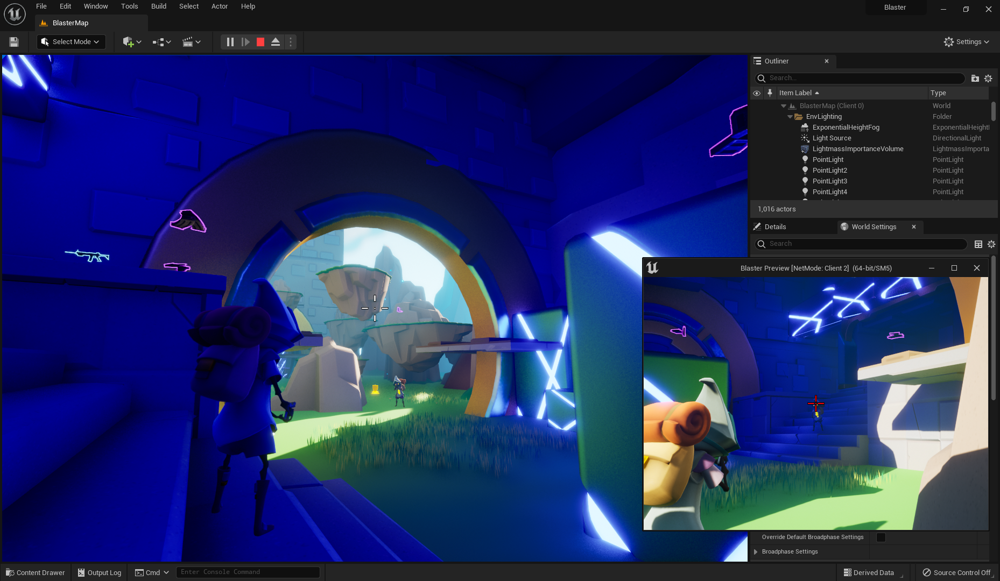
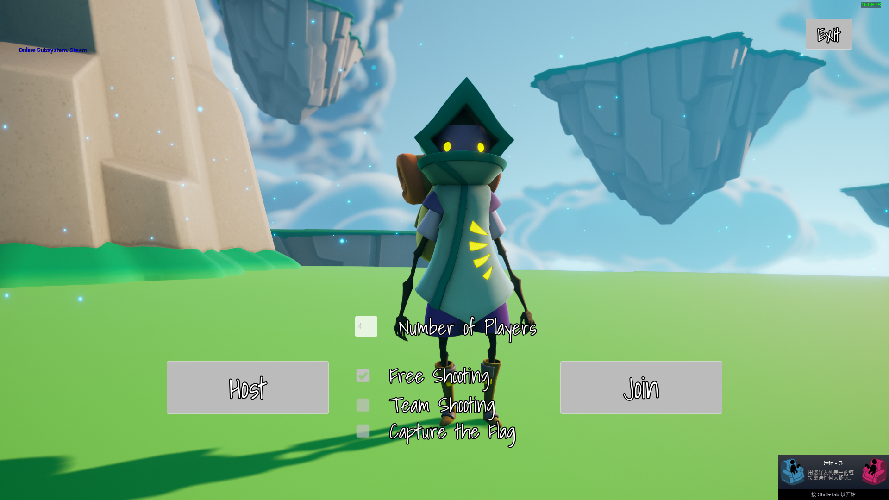

# UE5 Multiplayer Shooter

A Demo instructed by Udemy course: [Unreal Engine 5 C++ Multiplayer Shooter](https://www.udemy.com/course/unreal-engine-5-cpp-multiplayer-shooter/). One of the highest rated Unreal Engine multiplayer courses with more than 58 hours of contents.

### Unreal Assets Version Control

In this project I used [DVC (Data Version Control)](https://dvc.org/) for all the Unreal `Content/`, the files will be uploaded to my google drive instead of using the 1GB Github LFS free storage.

After DVC is installed, change to project directory, and simply execute command `dvc pull` to get files from remote.

### Features Checklist

✅ **Multiplayer Subsystem Plugin**
- Wrap it into a plugin with a Menu Widget Blueprint.
- Take advantage of Unreal "Online Subsystem" plugin and Steam services for managing sessions.
- Create, find and join sessions. Dynamic and static multi-cast delegates for handling service response.
- One-way dependency, Menu UI class depends on Subsystem class.

### Couse Introduction

- Connecting players across the internet with matchmaking sessions
- Creating a plugin to convert any Unreal Engine project to multiplayer
- Program multiplayer matchmaking in Unreal Engine
- Learn replication techniques for fast-paced, competitive shooter games
- Optimize network code by minimizing bandwidth and maximizing performance
- Lag compensation techniques for multiplayer including client-side prediction and server-side rewind
- Multiple weapons including pistols, SMGs, assault rifles, shotguns, sniper rifles, rocket launcher, grenade launchers, and throwing grenades
- Pickups including shields, health, speed buffs, jump buffs, and ammo pickups
- Crouching, aiming, jumping, strafing, reloading, and throwing, all in multiplayer
- Working HUD with health and shield bars, ammo count, score and defeats, and game timers
- Custom game modes, custom match states, and use of the core classes used in multiplayer
- Learn how the Game Mode, Game State, Player State, Player Controller, Pawn, Character, and Actor classes work in multiplayer
- Create your own subsystem to manage online sessions
- Learn about the Unreal Engine Online Subsystem and use it to program multiplayer games using any online service such as Steam
- Display announcements including: Who eliminated who, who won the game, winning teams, countdown timers
- Custom Match States: Fly around in the warmup stage, display winners in the cooldown stage

### Assets

- [Mixamo Animation](https://www.mixamo.com/#/)
- [Unreal Learning Kit](https://www.unrealengine.com/marketplace/en-US/product/unreal-learning-kit)
- [Animation Starter Pack](https://www.unrealengine.com/marketplace/en-US/product/animation-starter-pack)
- [Military Weapons Silver](https://www.unrealengine.com/marketplace/en-US/product/military-weapons-silver)
- [FPS Weapon Bundle](https://www.unrealengine.com/marketplace/en-US/product/fps-weapon-bundle)
- [Paragon: Dekker](https://www.unrealengine.com/marketplace/en-US/product/paragon-dekker)
- [Paragon: Wraith](https://www.unrealengine.com/marketplace/en-US/product/paragon-wraith)